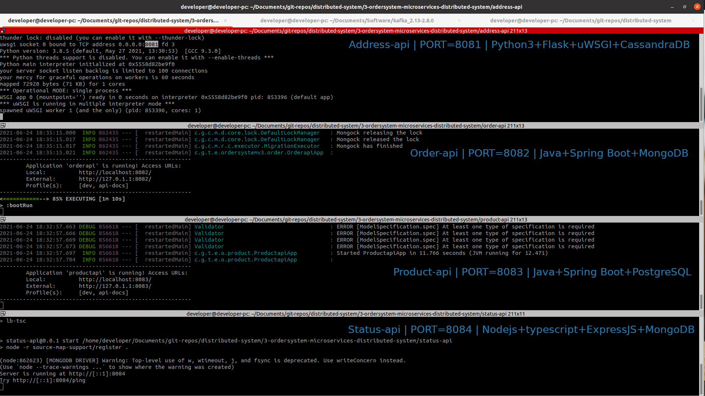

# 3-ordersystem-microservices-distributed-system
Microservies & distributed system: microservices develop using Java, Python, Nodejs and frontend using ReactJS

### Services description
- address-api: Python3, Flask, CassandraDB and uwsgi production web server. PORT=8081
- order-api: Java 11+, Gradle Build,  Sprint boot, Spring Data, Spring Security and MongoDB, +plus: Elasticsearch, Redis. HTTP PORT=8082
- product-api: Java 11+, Maven Build, Sprint boot, Spring Data, Spring Security and PostgreSQL, +plus: Elasticsearch, Redis. HTTP PORT=8083
- status-api: Nodejs, ExpressJS, MongoDB 3+. HTTP PORT=8084
- ordersystem-frontend: ReactJS, Redux, Typescript and Gateway security with Spring security, MongoDB. HTTP PORT=8080

### Start OR stop the pre-install requirements
```
# start
sudo systemctl start redis-server
sudo systemctl start elasticsearch  # Make sure to tunning for less memory consumming (+Bonus)
sudo systemctl start kibana
sudo systemctl start postgresql
sudo systemctl start cassandra
sudo systemctl start mongodb
# kafka
cd ~/Documents/Software/kafka_2.13-2.8.0
bin/zookeeper-server-start.sh config/zookeeper.properties #start zookeeper
bin/kafka-server-start.sh config/server.properties #start kafka

#status
sudo systemctl status redis-server
sudo systemctl status elasticsearch  
sudo systemctl status kibana
sudo systemctl status postgresql
sudo systemctl status cassandra
sudo systemctl status mongodb

#stop
sudo systemctl stop redis-server
sudo systemctl stop elasticsearch  
sudo systemctl stop kibana
sudo systemctl stop postgresql
sudo systemctl stop cassandra
sudo systemctl stop mongodb

```


### Run each services and the frontend (each services has the own README, make sure read it)
```
# address-api
cd address-api
./entrypoint.sh
open http://localhost:8081/api/
open http://localhost:8081/api/addresses
# make sure to insert some data in the cassandra db!

# order-api
cd order-api
./gradlew
open http://localhost:8082/


# product-api
cd order-api
./mvnw
open http://localhost:8083/


# status-api
cd status-api
npm start --port 8084
open http://localhost:8084/

# ordersystem-frontend
cd ordersystem-frontend
./gradlew
open http://localhost:8080/

# if you plan to modified the frontend and see the changes live
cd ordersystem-frontend
npm start
open http://localhost:9000/
```


### Labs
```
For you get more frontend knowledge, a good labs you can do is connect the UI with any of the microservices, can be just connect with the POST Method  of any of the services or the GET Method.
```


### References
```
For get the help of how install the database or tools used in this completed series, get the instruction from https://github.com/tomj0101/distributed-system/blob/main/0-dev-machine-setup/README.md
```

### This is how look when you run the monolithic enterprise
