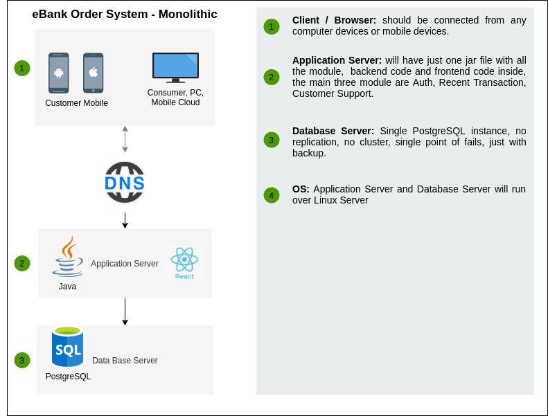

# Deploy nodejs application
this application is for a nodejs application, current version 2.5.14



| Modules | Description |
| ------  | ------ |
| Sell    | this is the sell&buy for Stock |
| MANT    | This is MANT |

## Sell
this is the sell module, this module has:

- Feature 1
- Feature 2
- Feature 3

#### Feature 1

> Especial text to show this
 
> Especial text to show this

## MANT
Some code to deploy
```sh
cd stock-app
npm i
npm start
```
## License

GNU
